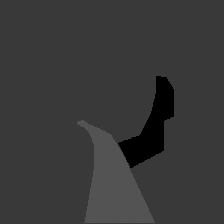

# path_segmentation

This is a case study-based project; in that, I look to use a Fully Convolutional Neural Network (FCN) to detect a path that a robot can travel along.

# Table of Contents

1. Requirements.
1. Installation.
1. Usage.
1. Contributions.
1. Credits.

# Requirements

I have used the following tools and libraries to create and run each project:

1. [TensorFlow](https://www.tensorflow.org/).
1. [Anaconda](https://www.continuum.io/).
1. [Nvidia CUDA](https://developer.nvidia.com/cuda-zone).
1. [Nvidia CUDNN](https://developer.nvidia.com/cudnn).
1. [Microsoft Visual Studio Code (Code)](https://code.visualstudio.com/).
1. [Code Python Extension](https://marketplace.visualstudio.com/items?itemName=donjayamanne.python).
1. [VGG Data](http://www.vlfeat.org/matconvnet/models/beta16/imagenet-vgg-verydeep-19.mat). 

The project has been compiled and run on PCs running Windows 7 x64 and Windows 10 x64 to ensure they work.

Please note: if you want to use TensorFlow on a GPU, you'll need to make sure your GPU supports Nvidia's CUDA, and install CUDA and CUDNN.

# Installation

The following is a list of steps to follow to get started with using this project':

1. Clone the tensorflow_projects repo'.
1. Install Anaconda and create a Python 3.5 environment for TensorFlow, e.g. 'tf' for TensorFlow running on a CPU or 'tf-gpu' for TensorFlow running on a GPU. Activate the environment and install jupyer, matplotlib, scipy, and tensorflow/tensorflow-gpu.
1. Install Code and the Python extension. 
1. Open a Windows command line and activate an environment. Type 'code' to open Code, then browse to the path_segmentation directory.

Since the network is large, its exported meta data is going to be too (it's approximately 2 GB per export). To help, in setup.py and main.py I've create a variable named default_dir, which can be any valid directory you want (just make sure the host drive, e.g. C:/, has enough space). default_dir should contain 'data', 'logs', and 'model' sub-directories. Download the VGG Data into the model sub-directory. setup.py will populate the data sub-directory. main.py will populate the logs sub-directory. Then, everything should be setup properly.

# Usage 

To generate the training and validation TFRecords, use Code's built-in console and type the following command: 

    python setup.py

To train the network, use Code's built-in console and type the following command: 

    python main.py --mode=train

To visualise the network's output, use code's built-in console and type the following command: 

    python main.py --mode=visualize

At this point, you should have generated TFRecords for the training and validation data sets, trained the neural network, and generated an infered output.

To run TensorBoard, use Code's built-in console and type the following command: 

    tensorboard --logdir=./logs

Afterwards, browse to 'localhost:6006' to view TensorBoard's panels.

After 30,000 training iterations, you should see an output similar to below:

# Contributions

If you feel like you can make a contribution; please, feel free to make a request.

# Credits

Dr. Frazer K. Noble. 
 
Follow me on Twitter at [@FrazerNoble](https://twitter.com/FrazerNoble).
